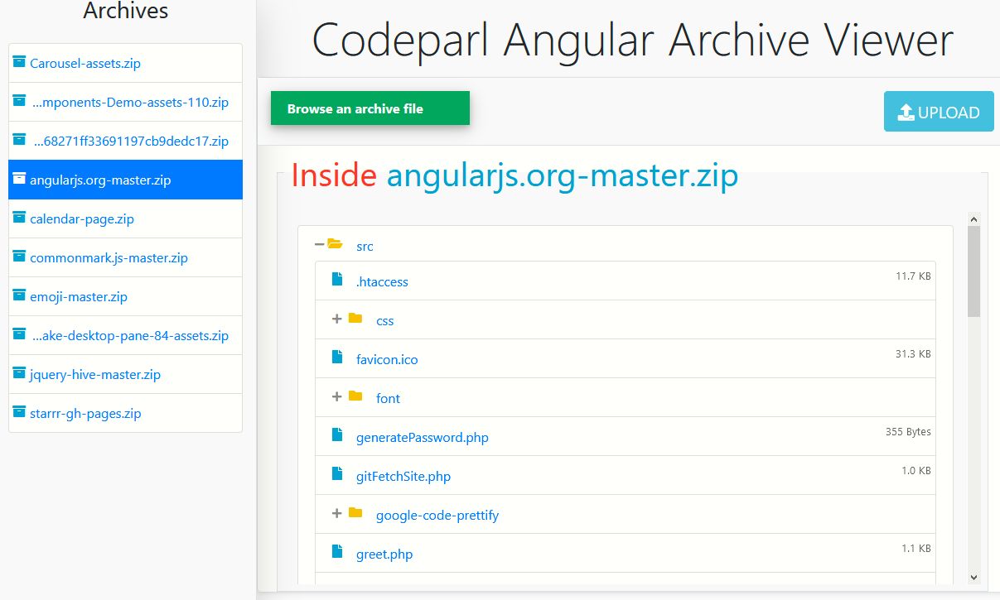

# Codeparl Angular Archive Viewer

## Description 

This is a small project based on angularjs and jQuery that may help you display contents of an archive file from a server using a PHP script to manage uploaded archive files. Note that this app only supports zip (.zip) files

## screenshot

## Author

Hassan Mugabo - @codeparl